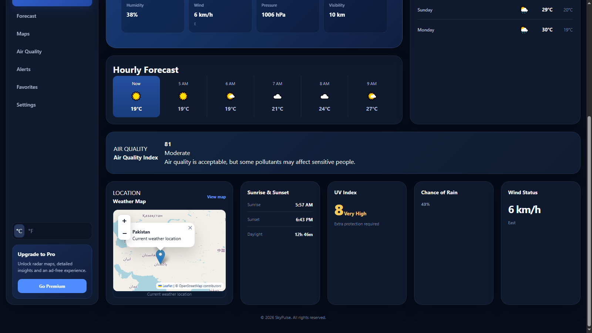
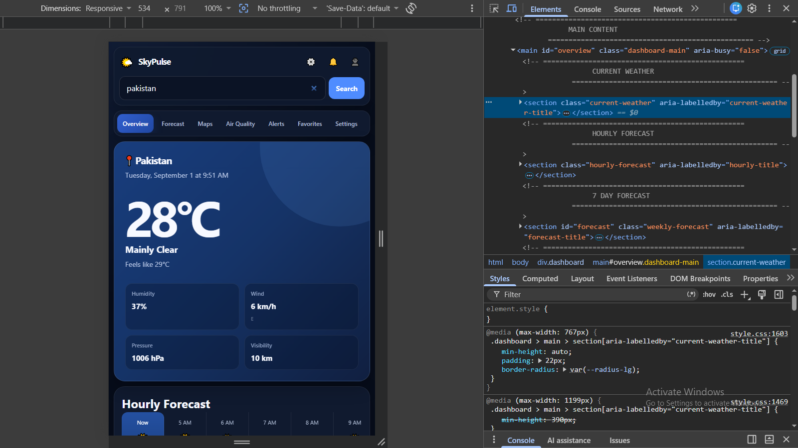

# 🌤️ SkyPulse — Modern Weather Dashboard

A modern, responsive weather dashboard built with HTML, CSS, and JavaScript.

## Live Demo

[View SkyPulse Weather App](https://sky-pulse-weather-app.netlify.app/)

## 📸 Screenshots

### Dashboard


### Forecast



### Responsive



## Features

- Real-time weather data via a live Weather API
- Current conditions: temperature, feels-like, humidity, wind, pressure, visibility
- Hourly forecast (next 6 hours)
- 7-day forecast
- Air Quality Index with description
- Sunrise/Sunset & daylight hours
- UV Index with protection advice
- Chance of rain & wind status
- Interactive location map (Leaflet + OpenStreetMap)
- °C / °F unit toggle
- Fully responsive — desktop, tablet, mobile

## Tech Stack

- HTML5
- Modern CSS3
- JavaScript (ES6+)
- Fetch API

## Project Structure

```text
index.html
style.css
script.js
screenshots/
README.md
```

## Run Locally

Open `index.html` directly in a browser, or run a local server:

```bash
python -m http.server 8000
```

Then visit:

```text
http://localhost:8000
```

## Notes

I built this weather app to improve my frontend development skills and practice JavaScript, API integration, responsive design, and dynamic UI. It fetches real-time weather data from an API and displays it in a clean and responsive interface.

## Author

- GitHub: [@syedfurqanullah](https://github.com/syedfurqanullah)
- LinkedIn: [Syed Furqan Ullah](https://www.linkedin.com/in/syed-furqan-ullah/)
